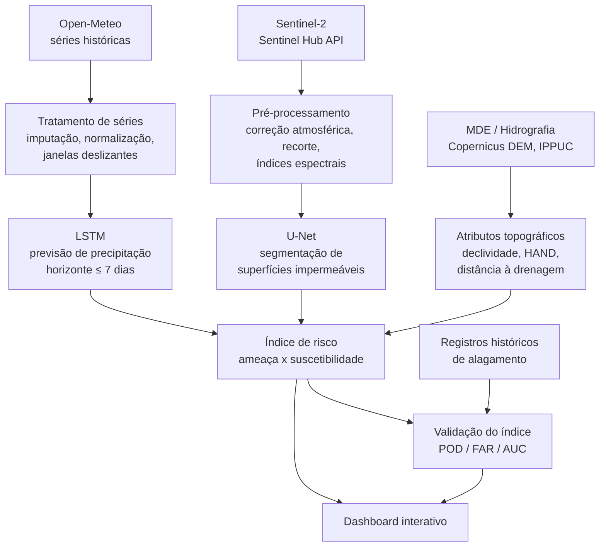

# flood-risk-curitiba

**Mapeamento de áreas de risco de alagamento em Curitiba com Deep Learning**

Segmentação de superfícies impermeáveis a partir de imagens Sentinel-2 (U-Net) integrada à previsão de precipitação de curto prazo (LSTM) para composição de um índice de risco de alagamento urbano.

> Trabalho de Conclusão de Curso — Ciência de Dados para Negócios
> FAE Centro Universitário · Curitiba · 2026


---

## Sobre o projeto

A impermeabilização do solo urbano converte precipitação em escoamento superficial, sobrecarregando a microdrenagem e produzindo alagamentos recorrentes. Os instrumentos tradicionais de monitoramento são reativos e de atualização lenta.

Este projeto investiga a seguinte questão:

> Como a integração entre a segmentação de superfícies impermeáveis por sensoriamento remoto e a previsão de precipitação de curto prazo pode apoiar a identificação de áreas suscetíveis a alagamento em Curitiba?

A entrega é um **protótipo funcional** que combina dois modelos de aprendizado profundo e variáveis topográficas em um índice de risco espacializado, apresentado em um dashboard interativo.

### Objetivos específicos

1. Coletar e pré-processar imagens Sentinel-2 e séries meteorológicas históricas para a área de estudo.
2. Desenvolver uma U-Net para segmentação de superfícies impermeáveis.
3. Desenvolver uma LSTM para previsão de precipitação diária em horizonte de até 7 dias.
4. Compor um índice de risco de alagamento integrando impermeabilização, atributos topográficos e precipitação prevista.
5. Validar o índice contra registros históricos de alagamento.
6. Disponibilizar os resultados em um dashboard interativo.

---

## Escopo

**O que este projeto faz**

- Mapeia superfícies impermeáveis em escala intraurbana (10 m) a partir de imagens ópticas.
- Prevê precipitação diária em horizonte curto (≤ 7 dias), sempre comparada a um baseline de climatologia/persistência.
- Combina ameaça (chuva prevista) e suscetibilidade (impermeabilização + topografia) em um índice de risco por célula da grade.
- Valida o índice contra ocorrências históricas registradas.

**O que este projeto não faz**

- Não modela a rede de microdrenagem (galerias, bocas de lobo, capacidade hidráulica), invisível ao sensoriamento remoto.
- Não trata inundação ribeirinha como fenômeno principal — o recorte é **alagamento** por saturação/deficiência de drenagem urbana.
- Não trata ilhas de calor urbanas: o Sentinel-2 não possui banda no infravermelho termal e, portanto, não deriva Temperatura de Superfície (LST). O tema fica registrado como trabalho futuro.
- Não substitui sistemas oficiais de alerta (Defesa Civil, CEMADEN, SIMEPAR). É uma ferramenta de apoio ao planejamento preventivo.

### Definições operacionais

| Termo | Definição adotada |
|---|---|
| **Alagamento** | Acúmulo temporário de água em vias e áreas urbanas por deficiência ou saturação da microdrenagem. |
| **Inundação** | Transbordamento de curso d'água sobre a planície de inundação. Fora do escopo principal. |
| **Evento crítico** | Precipitação acumulada em 24 h acima do percentil 95 (P95) da série histórica local. |
| **Suscetibilidade** | Predisposição física do terreno ao acúmulo de água, independente da chuva. |
| **Risco** | Combinação de ameaça (precipitação prevista) e suscetibilidade. |

---

## Arquitetura da solução



O fluxo de trabalho segue o modelo **CRISP-DM** (Cross-Industry Standard Process for Data Mining), em suas seis fases cíclicas.

---

## Fontes de dados

| Fonte | Conteúdo | Uso no projeto | Acesso |
|---|---|---|---|
| **Sentinel-2** (Copernicus/ESA) via Sentinel Hub API | Imagens multiespectrais, 10 m, revisita 5 dias | Segmentação de superfícies impermeáveis; índices NDVI, NDWI, NDBI | Público |
| **Open-Meteo API** | Séries históricas de precipitação, temperatura e umidade | Treinamento e avaliação da LSTM | Público |
| **Copernicus DEM / SRTM** | Modelo digital de elevação | Declividade, curvatura, HAND | Público |
| **IPPUC / Curitiba Dados Abertos** | Hidrografia, bacias, bairros, uso do solo | Delimitação, atributos de drenagem, apoio à rotulagem | Público |
| **MapBiomas / GHSL / Dynamic World** | Cobertura e uso do solo | Rótulos fracos (*weak labels*) para o treino da U-Net | Público |
| **OpenStreetMap** | Vetores de edificações e vias | Apoio à rotulagem, revisão visual supervisionada | Público |
| **Defesa Civil / S2iD / CEMADEN** | Registros históricos de ocorrências de alagamento | Validação do índice de risco e ajuste de pesos | A solicitar |

> ⚠️ **Dados brutos não são versionados neste repositório.** Rasters, séries baixadas e pesos de modelo ficam fora do controle de versão (ver `.gitignore`). Cada etapa do pipeline deve ser reproduzível a partir dos scripts de coleta.

---

## Metodologia

### Modelo 1 — U-Net (segmentação de superfícies impermeáveis)

- Encoder ResNet34 pré-treinado (transfer learning), decoder simétrico com skip connections.
- Perda combinada Binary Cross-Entropy + Dice Loss (0,5 : 0,5).
- Otimizador AdamW, early stopping, data augmentation (rotações, espelhamento, brilho, ruído).
- Rotulagem: rótulos fracos automatizados (MapBiomas / GHSL / OSM) no treino + **amostra anotada manualmente** no conjunto de teste.

### Modelo 2 — LSTM (previsão de precipitação)

- Entrada: janelas deslizantes multivariadas (precipitação, temperatura máx./mín., umidade).
- Saída: precipitação diária com horizonte de **até 7 dias** — e/ou probabilidade de evento crítico (classificação).
- Baseline obrigatório: climatologia e persistência. O desempenho é reportado como *skill score* em relação a esse baseline.

### Índice de risco

```
Risco = f(Ameaça, Suscetibilidade)

Ameaça         = precipitação prevista normalizada
Suscetibilidade = combinação ponderada de impermeabilização (U-Net),
                  declividade, HAND e distância à drenagem
```

Os pesos são definidos por um dos dois caminhos, a decidir conforme a disponibilidade de dados de ocorrência:

- **(a)** Modelo supervisionado (regressão logística ou Random Forest) treinado nos registros históricos de alagamento — permite avaliação objetiva por AUC.
- **(b)** Ponderação por análise multicritério (AHP) com validação posterior contra as ocorrências.

---

## Métricas de avaliação

| Componente | Métricas | Critério de aceitação |
|---|---|---|
| U-Net | Dice Coefficient, IoU, Precisão/Revocação/F1 por pixel | DC ≥ 0,75 |
| LSTM (regressão) | RMSE, MAE, *skill score* vs. baseline | Superar climatologia e persistência |
| LSTM (classificação) | F1, POD, FAR, CSI, Brier Score | A definir após linha de base |
| Índice de risco | POD/FAR contra ocorrências; AUC | A definir após obtenção dos registros |

Interpretabilidade (Grad-CAM para a U-Net, análise de atenção temporal para a LSTM) é tratada como **item opcional**, não como requisito.

---

## Stack tecnológica

| Camada | Ferramentas |
|---|---|
| Linguagem | Python 3.11 |
| Deep Learning | PyTorch |
| Geoprocessamento | Rasterio, GeoPandas, GDAL, Shapely |
| Dados | NumPy, Pandas, scikit-learn |
| Experimentos | MLflow |
| Visualização | Streamlit, Folium / Leaflet |
| Versionamento | Git / GitHub |

---

## Estrutura do repositório

```
flood-risk-curitiba/
├── data/                 # dados locais (não versionados)
│   ├── raw/              # downloads brutos
│   ├── interim/          # intermediários
│   └── processed/        # prontos para modelagem
├── notebooks/            # exploração e análise
├── src/
│   ├── data/             # coleta (Sentinel Hub, Open-Meteo, DEM)
│   ├── features/         # índices espectrais, atributos topográficos
│   ├── models/           # U-Net e LSTM
│   ├── risk/             # composição e validação do índice
│   └── visualization/    # mapas e figuras
├── app/                  # dashboard Streamlit
├── models/               # pesos treinados (não versionados)
├── reports/              # figuras e resultados para o texto do TCC
├── requirements.txt
└── README.md
```

> A estrutura acima é o alvo. As pastas serão criadas conforme o desenvolvimento avança.

---

## Como executar

```bash
# clonar
git clone https://github.com/<usuario>/flood-risk-curitiba.git
cd flood-risk-curitiba

# ambiente virtual
python -m venv .venv
source .venv/bin/activate      # Windows: .venv\Scripts\activate

# dependências
pip install -r requirements.txt

# credenciais das APIs
cp .env.example .env           # preencher com as chaves do Sentinel Hub
```

As credenciais do Sentinel Hub são pessoais e **nunca** devem ser commitadas.

---

## Roadmap

- [ ] Definir a área de estudo (bacias do Belém e do Barigui ou malha urbana completa)
- [ ] Solicitar registros históricos de alagamento à Defesa Civil / S2iD
- [ ] Implementar a coleta Sentinel-2 e Open-Meteo
- [ ] Construir o conjunto de rótulos de impermeabilidade
- [ ] Treinar e avaliar a U-Net
- [ ] Derivar atributos topográficos (declividade, HAND)
- [ ] Treinar e avaliar a LSTM contra baseline
- [ ] Compor e validar o índice de risco
- [ ] Desenvolver o dashboard
- [ ] Consolidar resultados no texto do TCC

---

## Equipe

| Integrante |
|---|
| Ana Júlia Luciano Kucharski |
| Eduardo de Oliveira Pereira |
| Henrique Bueno de Carvalho Reis |
| Jhonatan Atanazio |
| Vinicius Antunes do Prado |

**Orientação:** Prof.ª Dra. Julianna Crippa
**Instituição:** FAE Centro Universitário — Curso de Ciência de Dados para Negócios

---

## Referências principais

- RONNEBERGER, O.; FISCHER, P.; BROX, T. **U-Net: Convolutional Networks for Biomedical Image Segmentation**. MICCAI, 2015.
- MELGAR-GARCÍA, L. et al. **Comparação de arquiteturas U-Net para mapeamento de suscetibilidade a inundações**, 2023.
- DOS SANTOS, A.; GOMES-JR, L. **Previsão de inundações urbanas em Curitiba com redes LSTM**, 2025.
- DELIRY, S. I.; AVDAN, Z. Y.; AVDAN, U. **Extração de superfícies impermeáveis urbanas com Sentinel-2 e Landsat-8**, 2021.
- KOTARIDIS, I.; LAZARIDOU, M. **Segmentação de cobertura do solo urbano com superpixels e deep learning**, 2022.
- WIRTH, R.; HIPP, J. **CRISP-DM: Towards a Standard Process Model for Data Mining**, 2000.

A bibliografia completa consta no documento escrito do TCC.

---

## Licença

Distribuído sob a licença MIT. Ver [`LICENSE`](LICENSE).

Os dados de terceiros utilizados permanecem sujeitos às licenças de suas respectivas fontes.
